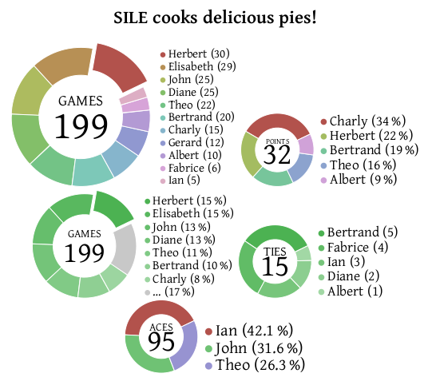

# piecharts.sile

[](LICENSE)
[](https://github.com/Omikhleia/piecharts.sile/actions?workflow=Luacheck)
[](https://luarocks.org/modules/Omikhleia/piecharts.sile)

This collection of packages for the [SILE](https://github.com/sile-typesetter/sile) typesetting system provides for the rendering of pie (donut) charts from data in CSV format.



## Installation

This module requires SILE v0.15.12.

Installation relies on the **luarocks** package manager.

To install the latest version, you may use the provided “rockspec”:

```
luarocks install piecharts.sile
```

(Refer to the SILE manual for more detailed 3rd-party package installation information.)

## Usage

Examples are provided in the [examples](./examples) folder.

The in-code package documentation may also be useful.
A readable version of the documentation is included in the User Manual for the [resilient.sile](https://github.com/Omikhleia/resilient.sile) collection of classes and packages.

## License

The code and samples in this repository are released under the MIT license, (c) 2022-2025 Omikhleia.
